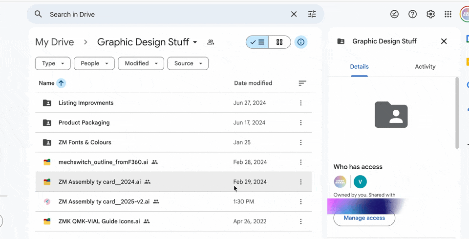

# Open in Finder - Google Drive
A simple macOS app that opens Finder and navigates to the folder containing any file you select. **Perfect for Google Drive integration** - when you want to quickly locate and view Google Drive files in their native folder context within Finder.

<table width="100%">
  <tr>
    <td width="25%" align="center" valign="middle">
      
    </td>
    <td align="center" valign="middle">
      
    </td>
  </tr>
</table>


## Usage
1. In Google Drive (web), right-click a file
2. Select "Open with" → "OpenInFinder" (if configured)
3. The file will be downloaded/synced and Finder will open to its location


## Requirements to Install & Run
- macOS 10.15 or later
<br><br>

## Download & Install
- Click [**⬇️ Download Latest Version Here ⬇️**](https://github.com/aziddy/Open-In-Finder-Google-Drive/releases/download/V1.0.0/OpenInFinder-unsigned.pkg)
- OR Click **Releases** on the right side of this page to download the version you want

⚠️ If you see a "blocked" message, see [UNSIGNED_INSTALL.MD](UNSIGNED_INSTALL.MD) for help ⚠️
<br><br>


## Build/Install From Source *(for developers)*

### Requirements to build from source
- macOS 10.15 or later
- AppleScript support (built into macOS)
- Xcode Command Line Tools (for building from source): `xcode-select --install`

#### Option 1) Easy Installation Script:
```bash
./install.sh
```
Both builds and installs App in your `/Applications` folder

#### Option 2) Manual Installation:
1. Run the build script:
   ```bash
   ./build.sh
   ```

2. Copy the generated app to your Applications folder:
   ```bash
   cp -r OpenInFinder.app /Applications/
   ```

3. Register the app with the system:
   ```bash
   /System/Library/Frameworks/CoreServices.framework/Versions/A/Frameworks/LaunchServices.framework/Versions/A/Support/lsregister -f /Applications/OpenInFinder.app
   ```

The app is now installed and ready to use!


## How it works
The app uses **AppleScript** to:
1. Receive the file path as a command-line argument
2. Tell Finder to reveal the file at that path
3. Activate Finder to bring it to the front

## Files
- `install.sh` - Installs the app in your `/Applications` folder and registers it with the system
- `Info.plist` - App configuration that makes it accept all file types
- `build.sh` - Build script to create the app bundle
- `OpenInFinder.app` - The final application bundle


## Troubleshooting
If the app doesn't appear in "Open With" menus:
1. Make sure it's in the `/Applications` folder
2. Try running: `lsregister -f /Applications/OpenInFinder.app`
3. Restart Finder: `killall Finder`