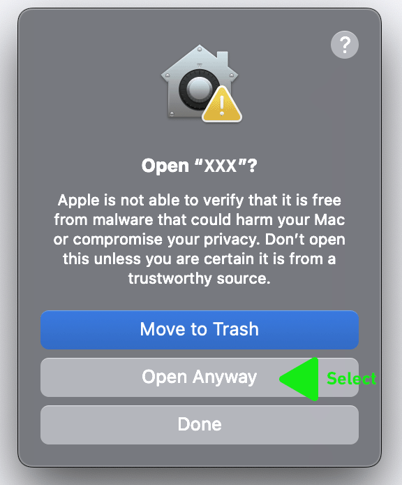

# Installing Unsigned PKG - Bypassing macOS Gatekeeper

This guide explains how to install the unsigned PKG installer (`OpenInFinder-unsigned.pkg`) by bypassing macOS Gatekeeper security warnings.

## Method 1: Right-Click Install (Recommended)

1. **Download** `OpenInFinder-unsigned.pkg`
2. **Right-click** the PKG file in Finder
3. Select **"Open"** from the context menu
4. Click **"Open"** in the security dialog that appears
5. Follow the installer prompts

## Method 2: Privacy & Security Settings

If Method 1 doesn't work or you see a "blocked" message:

1. **Double-click** `OpenInFinder-unsigned.pkg` (this will trigger the block)
2. **Open System Settings** (or System Preferences on older macOS)
3. Go to **"Privacy & Security"**
4. Scroll down to the **"Security"** section
   
5. You'll see a message about the blocked installer
6. Click **"Open Anyway"** next to the blocked app message
     
7. Click **"Open"** in the confirmation dialog
8. Follow the installer prompts

## Method 3: Command Line Override

For advanced users, you can temporarily disable Gatekeeper:

```bash
# Install the PKG
sudo installer -pkg OpenInFinder-unsigned.pkg -target /

# Optional: Re-enable Gatekeeper after installation
sudo spctl --master-enable
```

## Why This Happens

macOS Gatekeeper blocks unsigned software to protect users from malicious applications. The unsigned PKG installer hasn't been:
- Code signed with a Developer ID certificate  
- Notarized by Apple

## After Installation

Once installed, OpenInFinder will work normally. You may need to:

1. **Grant permissions** if prompted when first using the app
2. **Restart Finder** if the app doesn't appear in "Open With" menus:
   ```bash
   killall Finder
   ```

<!-- ## Alternative: Use Signed Version

For the best user experience without security warnings, use the signed and notarized version instead. See `BUILD-SIGNED.md` for creating a signed installer. -->

## Troubleshooting

### "Cannot be opened because it is from an unidentified developer"
- Use Method 1 (right-click � Open) or Method 2 (Privacy & Security settings)

### "This package is damaged and can't be opened"  
- Download the PKG file again
- Check file integrity
- Try Method 3 (command line installation)

### App doesn't appear in "Open With" menus
- Restart Finder: `killall Finder`
- Re-register the app: `lsregister -f /Applications/OpenInFinder.app`
- Log out and back in