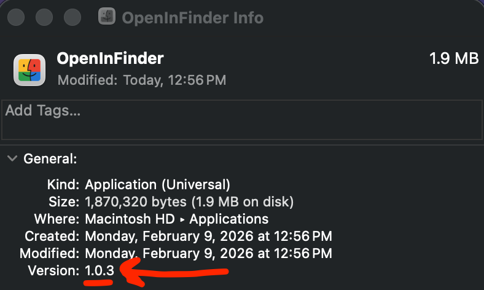

# New Release Procedure

## 1) Update Version in Code/Binary
- Update the version in the `build-pkg-signed.sh` script
- Update the version in the `build-pkg.sh` script
```bash
--version 1.0.x \
```
- Update `Info.plist` file
```bash
<key>CFBundleVersion</key>
<string>1.0.x</string>
<key>CFBundleShortVersionString</key>
<string>1.0.x</string>
```

## 2) Build and Test
```bash
./build-pkg.sh
```
- Install new PKG

- Confirm version by going to `/Applications/`
    - Right Click on `OpenInFinder` App
      - Select `Get Info`  
      


## 3) Github Releases
1. On GitHub Page Repo, click on `Releases`
2. Click on `Draft a new release`
3. Enter the release title and description
   - Release title: `OpenInFinder V1.0.x Unsigned - Universal Binary (x86/Arm64)`
   - Select the tag box
     - Select `Create new tag`
     - Enter the tag version: `V1.0.x`
   - Copy and paste default description from previous release
4. Drag and drop the `OpenInFinder-unsigned.pkg` file into the release assets

## 4) Update README.md Link to new Release
- Copy link address on `OpenInFinder-unsigned.pkg` file
- Update `README.md` file
```bash
<a href="https://github.com/aziddy/Open-In-Finder-Google-Drive/releases/download/V1.0.x/OpenInFinder-unsigned.pkg">
  
</a><br>
```

## 5) Commit and Push Changes